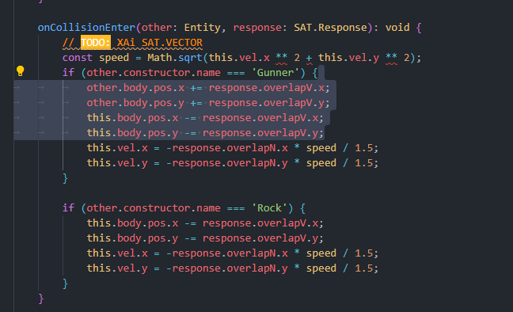

client: skip ticks & xai lerp

double t = 0.0;
double dt = 0.01;

    double currentTime = hires_time_in_seconds();
    double accumulator = 0.0;

    State previous;
    State current;

    while ( !quit )
    {
        double newTime = time();
        double frameTime = newTime - currentTime;
        if ( frameTime > 0.25 )
            frameTime = 0.25;
        currentTime = newTime;

    accumulator += frameTime;

    while ( accumulator >= dt )
        {
            previousState = currentState;
            integrate( currentState, t, dt );
            t += dt;
            accumulator -= dt;
        }

    const double alpha = accumulator / dt;

    State state = currentState * alpha +
            previousState * ( 1.0 - alpha );

    render( state );
    }

server: sync ticks, neu behind qua nhieu ticks thi skip het
double t = 0.0;
double dt = 1 / 60.0;

    double currentTime = hires_time_in_seconds();

    while ( !quit )
    {
        double newTime = hires_time_in_seconds();
        double frameTime = newTime - currentTime;
        currentTime = newTime;

    while ( frameTime > 0.0 )
        {
            float deltaTime = min( frameTime, dt );
            integrate( state, t, deltaTime );
            frameTime -= deltaTime;
            t += deltaTime;
        }

    render( state );
    }

MỖI entity có các thuộc tính của riêng và define = decorator @type, thay vì refefine lại hết SATBody

entity: Mỗi Entity sẽ export + stats + Entity itself

entity server: Schema lại 2 cái trên

---

Khi xử lí va chạm mà có thay đổi giá trị của position, hoặc các giá trị khác có thay đổi khả năng va chạm giữa chúng (thay đổi mà cả 2 ko còn choảng nhau nữa) thì other có thể ko nhận đc event onCollisionEnter

